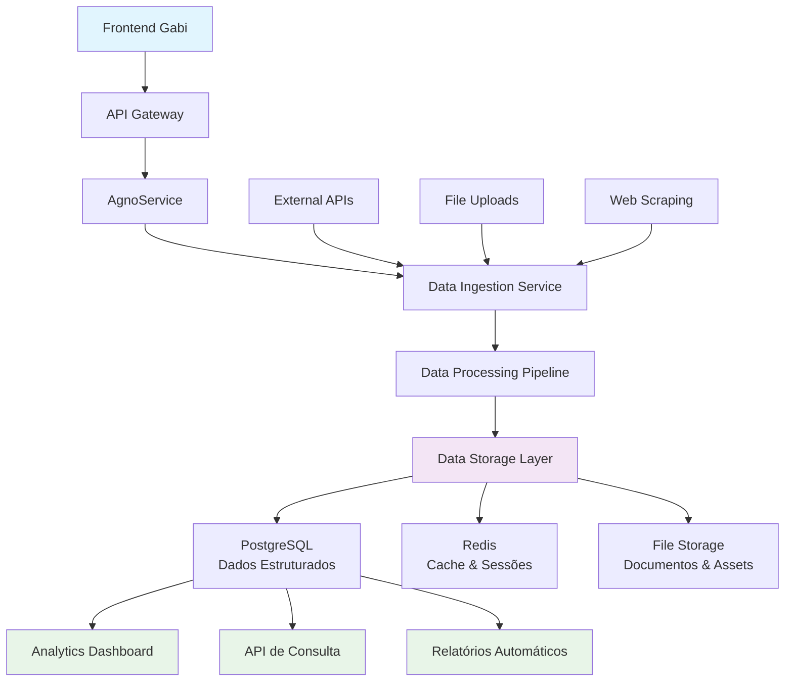

# Arquitetura de Persistência de Dados de Ingestão

## Visão Geral

Sistema para persistir dados de ingestão do backend para documentação e consulta.

## Diagrama de Arquitetura



## Componentes Principais

### 1. Data Ingestion Service
- **Responsabilidade**: Capturar e normalizar dados de múltiplas fontes
- **Fontes**: APIs externas, uploads de arquivos, web scraping
- **Tecnologia**: Python/FastAPI com workers assíncronos

### 2. Data Processing Pipeline
- **Responsabilidade**: Transformar, validar e enriquecer dados
- **Processos**: Limpeza, normalização, classificação, indexação
- **Tecnologia**: Apache Airflow ou Celery para orquestração

### 3. Data Storage Layer
- **PostgreSQL**: Dados estruturados, relacionamentos, consultas SQL
- **Redis**: Cache, sessões, dados temporários
- **File Storage**: Documentos, imagens, assets binários

### 4. Analytics & Query Layer
- **Dashboard**: Visualização de métricas e KPIs
- **API de Consulta**: Endpoints para buscar dados históricos
- **Relatórios**: Geração automática de relatórios

## Modelos de Dados

### IngestionRecord
```sql
CREATE TABLE ingestion_records (
    id UUID PRIMARY KEY,
    source_type VARCHAR(50) NOT NULL, -- 'api', 'file', 'web', 'manual'
    source_name VARCHAR(255) NOT NULL,
    data_type VARCHAR(100) NOT NULL, -- 'text', 'image', 'document', 'structured'
    file_path VARCHAR(500),
    metadata JSONB,
    status VARCHAR(20) DEFAULT 'pending', -- 'pending', 'processing', 'completed', 'failed'
    created_at TIMESTAMP DEFAULT NOW(),
    processed_at TIMESTAMP,
    error_message TEXT
);
```

### DataContent
```sql
CREATE TABLE data_content (
    id UUID PRIMARY KEY,
    ingestion_record_id UUID REFERENCES ingestion_records(id),
    content_type VARCHAR(100) NOT NULL,
    content_data TEXT,
    file_path VARCHAR(500),
    extracted_text TEXT,
    metadata JSONB,
    created_at TIMESTAMP DEFAULT NOW()
);
```

### ProcessingLog
```sql
CREATE TABLE processing_logs (
    id UUID PRIMARY KEY,
    ingestion_record_id UUID REFERENCES ingestion_records(id),
    step_name VARCHAR(100) NOT NULL,
    status VARCHAR(20) NOT NULL,
    processing_time_ms INTEGER,
    details JSONB,
    created_at TIMESTAMP DEFAULT NOW()
);
```

## APIs de Consulta

### GET /api/data/ingestions
- Lista todas as ingestões com filtros
- Paginação e ordenação
- Filtros por data, tipo, status

### GET /api/data/ingestions/{id}
- Detalhes de uma ingestão específica
- Histórico de processamento
- Dados extraídos

### GET /api/data/search
- Busca full-text nos dados
- Filtros por tipo de conteúdo
- Faceted search

### GET /api/analytics/ingestion-stats
- Estatísticas de ingestão
- Métricas de performance
- Gráficos e dashboards

## Benefícios da Implementação

1. **Auditoria Completa**: Rastreamento de todas as operações
2. **Debugging Facilitado**: Logs detalhados de processamento
3. **Compliance**: Atendimento a requisitos regulatórios
4. **Analytics**: Insights sobre uso e performance
5. **Reprocessamento**: Capacidade de reprocessar dados
6. **Escalabilidade**: Suporte a grandes volumes de dados

## Próximos Passos

1. Implementar modelos de banco
2. Criar serviços de ingestão
3. Desenvolver APIs de consulta
4. Configurar pipeline de processamento
5. Implementar dashboard de analytics
